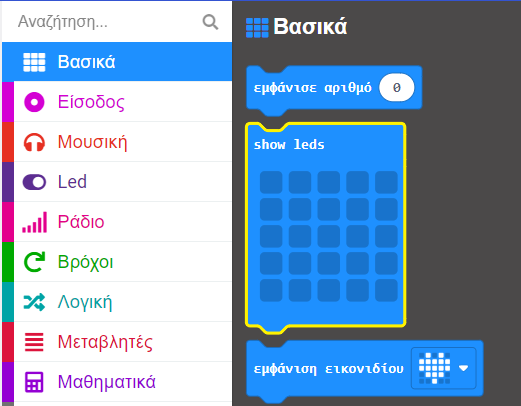
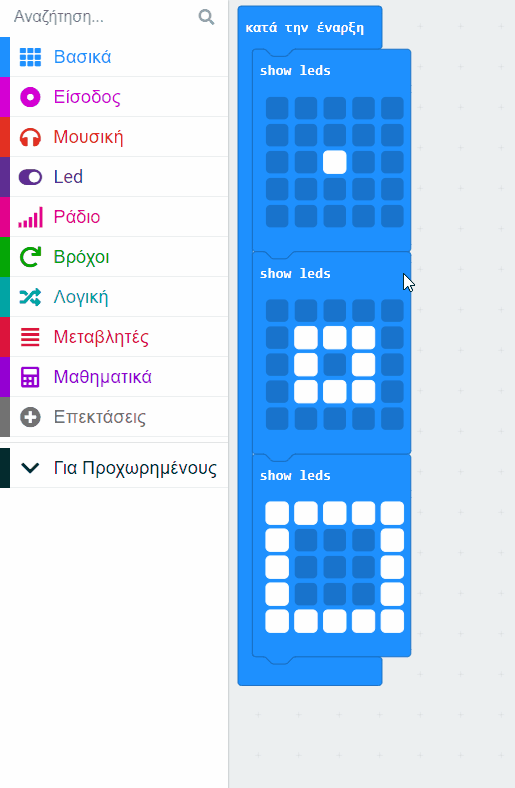

Για να δημιουργήσεις μια κινούμενη εικόνα, μπορείς να βάλεις **πολλαπλά** μπλοκ "show led"{:class='microbitbasic'} μαζί.

Εδώ είναι ένα παράδειγμα.

```microbit
basic.showLeds(`
    . . . . .
    . . . . .
    . . # . .
    . . . . .
    . . . . .
    `)
basic.showLeds(`
    . . . . .
    . # # # .
    . # . # .
    . # # # .
    . . . . .
    `)
basic.showLeds(`
    # # # # #
    # . . . #
    # . . . #
    # . . . #
    # # # # #
    `)
```

Μπορείς να βρεις το μπλοκ `show led`{:class='microbitbasic'} στο μενού `Βασικά`{:class='microbitbasic'} στην Εργαλειοθήκη σου.



Σύρε τρία μπλοκ "show led"{:class='microbitbasic'} και τοποθέτησέ τα μαζί.

**Συμβουλή:** 💡 Πρόσθεσε περισσότερα μπλοκ αν θέλεις κινούμενη εικόνα που να διαρκεί περισσότερο.

Κάνε κλικ στα τετράγωνα σε κάθε μπλοκ για να δημιουργήσεις ένα μοτίβο.

**Συμβουλή:** 💡 Κράτησε πατημένο το ποντίκι για να επιλέξεις πολλά LED καθώς μετακινείσαι.

Όταν εκτελείται ο κώδικας, τα LED θα εμφανίζουν κάθε εικόνα με τη σειρά.

## Τοποθέτησε την κινούμενη εικόνα σου σε βρόχο

Από το μενού "Βρόχοι"{:class='microbitloops'}, σύρε ένα μπλοκ "επανάληψη"{:class='microbitloops'} και τοποθέτησέ το γύρω από τα μπλοκ "show led"{:class='microbitbasic'}.

Άλλαξε τον αριθμό των επαναλήψεων από «4» στον αριθμό των επαναλήψεων που θέλεις να επαναλαμβάνεται η κινούμενη εικόνα.


