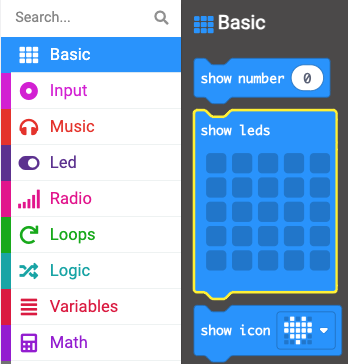
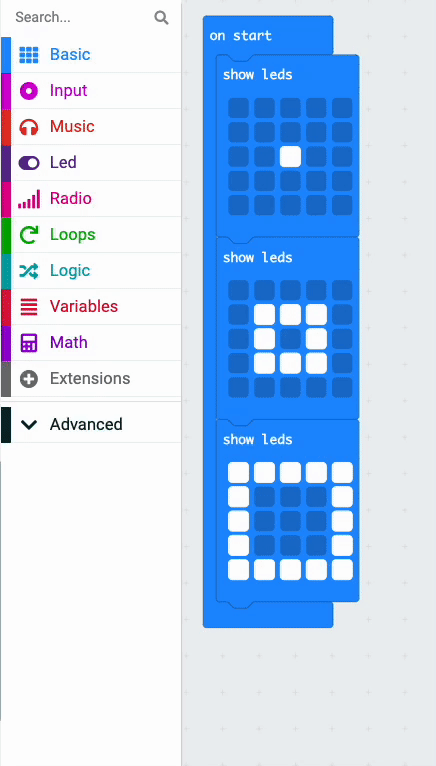

To create an animation, you can put **multiple** 'show leds' blocks together.

Here is an example.

<iframe style="position:relative;top:0;left:0;width:50%;height:100%;" src="https://makecode.microbit.org/---codeembed#pub:_gDu6afhiWDM0" allowfullscreen="allowfullscreen" frameborder="0" sandbox="allow-scripts allow-same-origin"></iframe>

You can find the `show leds`{:class='microbitbasic'} block in the `Basic`{:class='microbitbasic'} block menu in your Toolbox.

Drag out three `show leds`{:class='microbitbasic'} blocks and put them together.

**Tip:** 💡 Add more blocks if you want a longer animation.

Click the squares on each one to create a pattern. 

**Tip:** 💡 Hold down the mouse to select multiple LEDs as you move.

When the code runs, the LEDs will display each image in turn. 

## Looping your animation

From the `Loops`{:class='microbitloops'} menu, drag a `repeat`{:class='microbitloops'} block and place it around the `show leds`{:class='microbitbasic'} blocks.

Change the number of repeats from `4` to the number of times you want the animation to repeat.

