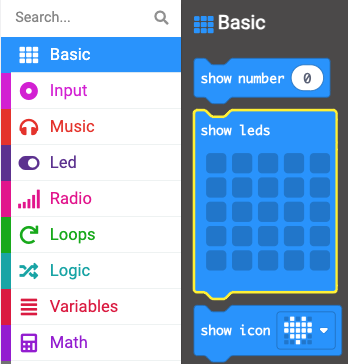
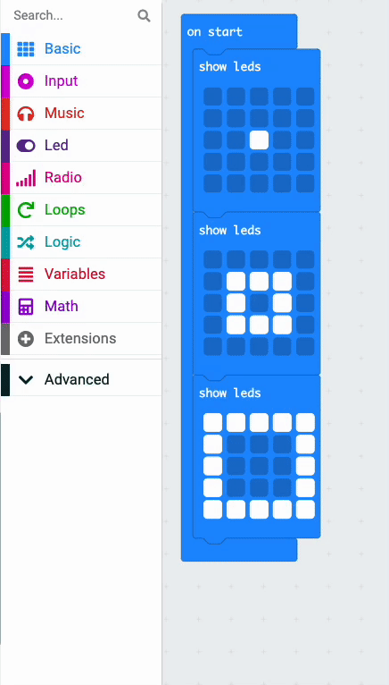

Pour créer une animation, tu peux mettre **plusieurs** blocs `montrer LEDs`{:class='microbitbasic'} ensemble.

Voici un exemple.

```microbit
basic.showLeds(`
    . . . . .
    . . . . .
    . . # . .
    . . . . .
    . . . . .
    `)
basic.showLeds(`
    . . . . .
    . # # # .
    . # . # .
    . # # # .
    . . . . .
    `)
basic.showLeds(`
    # # # # #
    # . . . #
    # . . . #
    # . . . #
    # # # # #
    `)
```

Tu peux trouver le bloc `montrer LEDs`{:class='microbitbasic'} dans le menu `Base`{:class='microbitbasic'} dans ta boîte à outils.



Fais glisser trois blocs `montrer LEDs`{:class='microbitbasic'} et mets-les ensemble.

**Astuce :** 💡 Ajoute plus de blocs si tu veux une animation plus longue.

Clique sur les carrés de chaque bloc pour créer un motif.

**Astuce :** 💡 Maintiens la souris enfoncée pour sélectionner plusieurs LED à mesure que tu bouges.

Lorsque le code s'exécute, les LED afficheront chaque image à son tour.

## Boucler ton animation

Dans le menu `Boucles`{:class='microbitloops'}, fais glisser un bloc `répéter`{:class='microbitloops'} et place-le autour des blocs `montrer LEDs`{:class='microbitbasic'}.

Modifie le nombre de répétitions de `4` en nombre de fois que tu veux que l'animation se répète.


