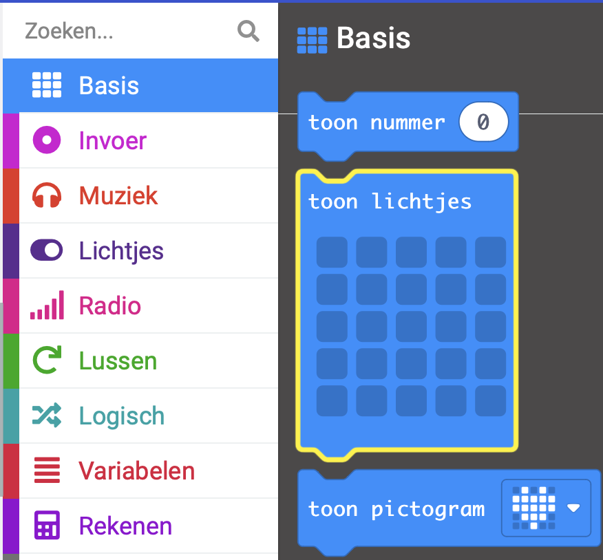
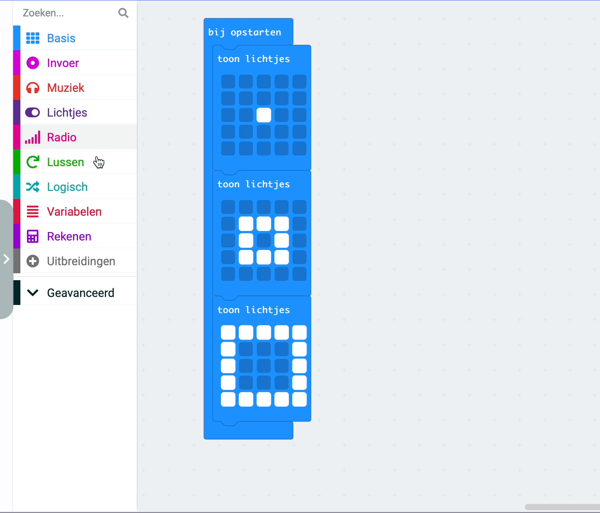

Om een animatie te maken, kun je **meerdere** `toon lichtjes`{:class='microbitbasic'} blokken samenvoegen.

Hier is een voorbeeld.

```microbit
basic.showLeds(`
    . . . . .
    . . . . .
    . . # . .
    . . . . .
    . . . . .
    `)
basic.showLeds(`
    . . . . .
    . # # # .
    . # . # .
    . # # # .
    . . . . .
    `)
basic.showLeds(`
    # # # # #
    # . . . #
    # . . . #
    # . . . #
    # # # # #
    `)
```

Je kunt het blok `toon lichtjes`{:class='microbitbasic'} vinden in het `Basis`{:class='microbitbasic'} menu in je Toolbox.



Sleep drie `toon lichtjes`{:class='microbitbasic'} blokken naar het bewerkingspaneel en voeg ze samen.

**Tip:** 💡 Voeg meer blokken toe als je een langere animatie wilt.

Klik op de vierkantjes van elk blok om een patroon te creëren.

**Tip:** 💡 Houd de muis ingedrukt om meerdere LED's te selecteren terwijl je beweegt.

Wanneer de code wordt uitgevoerd, geven de LED's de afbeeldingen om de beurt weer.

## Herhaal je animatie

Vanuit het `Lussen`{:class='microbitloops'} menu sleep je een `keer herhalen`{:class='microbitloops'} blok en plaats je het rond de `toon lichtjes`{:class='microbitbasic'} blokken.

Wijzig het aantal herhalingen van `4` naar het aantal keren dat je de animatie wilt herhalen.


